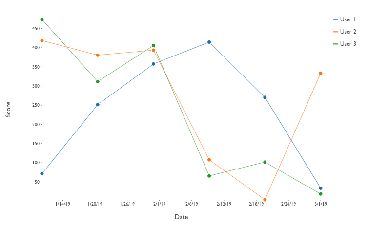
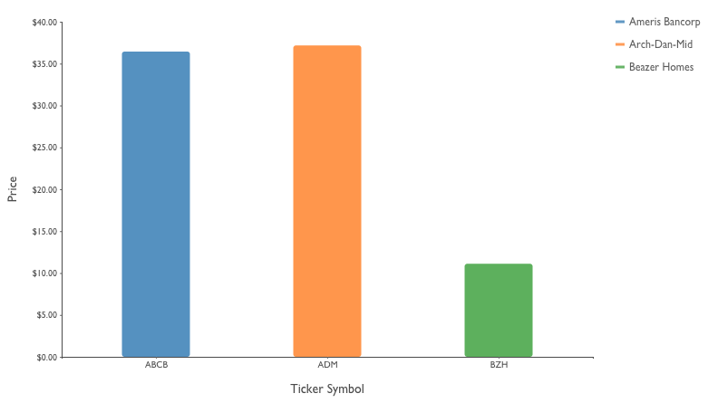
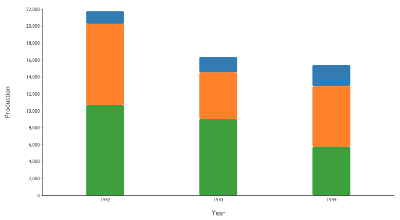
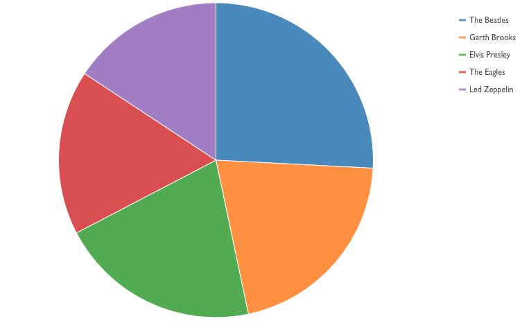

# stencil-vizzle

Reusable visualization web components built with Stencil and D3.js

### Motivation
I've been using D3.js since 2012 &mdash; almost as long as it's been out &mdash; and have built highly configurable, reusable charting functions/classes within a variety of frameworks, namely ExtJS, AngularJS, and React.

As much as I tried to make the charts "universal" in terms of porting across frameworks, there have always been library idiosyncrasies standing in the way, most notably in terms of DOM manipulation, data binding and render lifecycles.

As the Custom Elements specification has matured and browser support has improved, I felt I finally had the opportunity to create true "write once, run anywhere" visualization web components and so here we are.

### TL/DR Quickstart

**Running locally**  
```sh
# checkout project
$> npm i
$> npm start
# browser should open to localhost:3333
```

### Available Chart Components

All components are highly configurable, via attributes, to offer the most flexibility in terms of conveying as much or as little information as you wish.

#### &lt;stv-line-chart&gt;  

[README](readme/README-STV-LINE-CHART.md) 



#### &lt;stv-bar-chart&gt;  

[README](readme/README-STV-BAR-CHART.md)



#### &lt;stv-stacked-bar-chart&gt;  

[README](readme/README-STV-STACKED-BAR-CHART.md)



#### &lt;stv-pie-chart&gt;  

[README](readme/README-STV-PIE-CHART.md)



### Developer Section

**Testing**  
```sh
# unit tests, single run
$> npm run test

# unit tests, watch mode
$> npm run test:watch

# e2e tests, single run
$> npm run e2e

# e2e tests, watch mode
$> npm run e2e:watch
```

**Linting**  
```sh
# lint js (tsx) and scss
$> npm run lint

# lint only the *.tsx files
$> npm run lint:stencil

# lint only the *.scss files
$> npm run lint:scss
```


