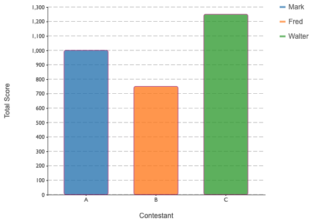

# stencil-vizzle

Reusable, easy-to-use visualization web components built with Stencil and D3.js

### Motivation
I've been using D3.js since 2012 &mdash; almost as long as it's been out &mdash; and have built highly configurable, reusable charting functions/classes within a variety of frameworks, namely ExtJS, AngularJS, and React.

As much as I tried to make the charts "universal" in terms of porting across frameworks, there have always been library idiosyncrasies standing in the way, most notably in terms of DOM manipulation, data binding and render lifecycles.

As the Custom Elements specification has matured and browser support has improved, I felt I finally had the opportunity to create true "write once, run anywhere" visualization web components and so here we are.

### Inspiration

`stencil-vizzle` takes its cue from the core tenet of `D3.js`, e.g. *Data-Driven Documents* and is influenced by frameworks like [RAW/RAWGraphs](https://rawgraphs.io) i.e., ad-hoc mapping of data properties to attributes in your custom element.

### Features  
- Framework agnostic
- No third party libaries required
- In general, requires little to no transformation of your data prior to use.
- Highly customizable
- Show or hide chart features like axes, legend, gridlines, and/or axis labels.
- Adjustable margins, stroke, stroke width and font sizes
- `inverse` support for use on darker backgrounds.

###  Quick Example w/ Unpkg ```<script>``` Tag

A simple, customizable bar chart using user-specified property -> attribute mappings.  See the individual READMEs for information on available attributes and how to use them.

```html
<!DOCTYPE html>
<html lang="en">
<head>
  <meta charset="utf-8">
  <meta name="viewport" content="width=device-width, initial-scale=1.0, minimum-scale=1.0, maximum-scale=5.0">
  <title>stencil-vizzle</title>
  <script type="module" src="https://unpkg.com/stencil-vizzle@0.0.1/dist/stencil-vizzle/stencil-vizzle.esm.js"></script>
  <script nomodule="" src="https://unpkg.com/stencil-vizzle@0.0.1/dist/stencil-vizzle/stencil-vizzle.js"></script>
  <style type="text/css">
    body {
      padding: 20px;
      font-family: "Arial", "Helvetica", sans-serif;
    }
  </style>
</head>
<body>
  <stv-bar-chart
    axis-label-font-size="12"
    bar-stroke="#990066"
    chart-id="myStvBarChart"
    canvas-width="600"
    canvas-height="400"
    gridlines
    legend
    legend-metric="name"
    margin-left="35"
    ordinal-metric="contestant"
    linear-metric="score"
    linear-tick-format="localestring"
    tooltips
    x-label="Contestant"
    y-label="Total Score">
  </stv-bar-chart>
</body>

<script>
  document.addEventListener('stv-bar-chart-loaded', function() {
    var data = [
      {contestant: 'A', name: 'Mark', score: 1000},
      {contestant: 'B', name: 'Fred', score: 750},
      {contestant: 'C', name: 'Walter', score: 1250}
    ]
    document.querySelector('stv-bar-chart').chartData = data
  })
</script>
</html>
```

...and you should see something like this:




### TL/DR Quickstart

**Run Demo Application**  
```sh
# checkout project
$> npm i
$> npm run demo
# browser should open to localhost:5150
```

### Chart Components

All components are highly configurable via their supported attributes to offer the most flexibility in terms of tailoring your visualization to convey as much or as little information as you wish.

#### &lt;stv-line-chart&gt;  

[README](readme/README-STV-LINE-CHART.md) 


#### &lt;stv-bar-chart&gt;  

[README](readme/README-STV-BAR-CHART.md)


#### &lt;stv-stacked-bar-chart&gt;  

[README](readme/README-STV-STACKED-BAR-CHART.md)


#### &lt;stv-pie-chart&gt;  

[README](readme/README-STV-PIE-CHART.md)


### Developer Section

**Dev Server**  
```sh
# checkout project
$> npm i
$> npm start
# browser should open to localhost:3333
```

**Testing**  
```sh
# unit tests, single run
$> npm run test

# unit tests, watch mode
$> npm run test:watch

# e2e tests, single run
$> npm run e2e

# e2e tests, watch mode
$> npm run e2e:watch
```

**Linting**  
```sh
# lint js (tsx) and scss
$> npm run lint

# lint only the *.tsx files
$> npm run lint:stencil

# lint only the *.scss files
$> npm run lint:scss
```
