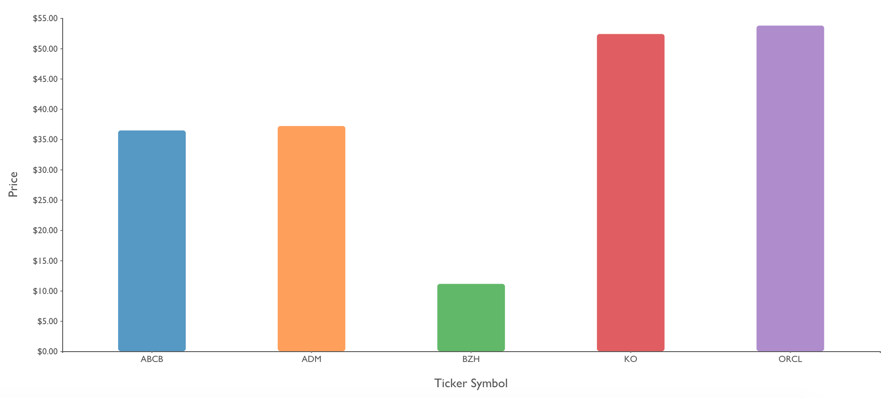
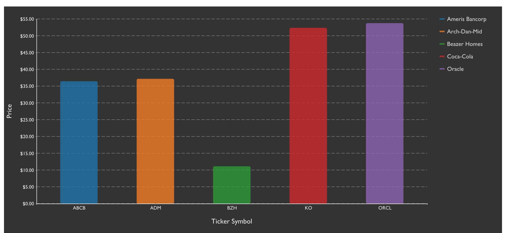
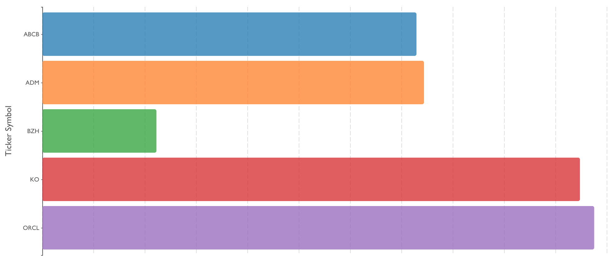

# ```<stv-bar-chart>```

### Overview
A highly configurable, W3C-compliant web component for generating D3.js SVG bar charts from pretty much any properly formatted data.  By using the modularized, ES6-ready distribution of D3.js (v5), the bundle size has been kept slim.

### Features
- Data rebind transitions
- One axis is linearly scaled, the other is scaled ordinally.
- Show or hide the X and/or Y axes
- Show or hide the X and/or Y axis tick values
- Show or hide the X and/or Y axis labels
- Show or hide a legend
- Vertical (default) or horizontal orientation
- Configurable margins
- Configurable tick sizes
- Configurable axis font family
- `inverse` attribute for darker backgrounds
- Built in tooltips

### Examples







### Properties / Attributes

| Attribute &nbsp; &nbsp; &nbsp; &nbsp; &nbsp; &nbsp; &nbsp; &nbsp; &nbsp; &nbsp; &nbsp; &nbsp; &nbsp; &nbsp; &nbsp; &nbsp; &nbsp; &nbsp;   | Type | Default Value | Description |
| --------- | ---- | ------------- | ----------- |
| axis-label-font-size | number | 14 | Font size of optional X/Y axis labels |
| axis-tick-font-family | string | "sans" | "sans", "serif" or "monospace" |
| axis-tick-font-size | number | 10 | Font size of axis tick values |
| bar-stroke | string | "transparent" | Stroke color of bars |
| bar-stroke-width | number | 1 | Stroke width of bars |
| canvas-height | number | 300 | Height of SVG drawing canvas |
| canvas-width | number | 500 | Width of SVG drawing canvas |
| [chart-data](#chart-data) | array | [] | Array of objects used to populate the visualization |
| chart-id | string | "" | Optional id for custom element |
| color-scheme | string | "category10" | Color palette to use for bars.  See [Color Schemes](#color-schemes) below  |
| gridlines | bool | false | Display X/Y grid lines for value reference |
| hide-x-axis | bool | false | Hide both the X axis line and tick values |
| hide-x-ticks | bool | false | Hide only the X axis tick values |
| hide-y-axis | bool | false | Hide both the Y axis line and tick values |
| hide-y-ticks | bool | false | Hide only the Y axis tick values |
| inverse | bool | false | Invert axis and legend colors for use on a darker background |
| legend | bool | false | Set to true to show the right side legend |
| legend-font-size | number | 12 | Font size of legend text elements |
| legend-metric | string | "label" | Name of ```chartData.data``` property to display in the legend |
| legend-width | number | 125 | Width, in pixels, the legend will occupy in the drawing canvas. |
| linear-metric | string | "value" | Property in `chart-data` to map to the linear scale calculation |
| linear-tick-format | string | "raw" | How to format the linear axis tick values.  See the [tick formatting README](README-TICK-FORMAT.md).
| margin-bottom | number | 25 | Bottom padding |
| margin-left | number | 25 | Left padding |
| margin-right | number | 25 | Right padding |
| margin-top | number | 25 | Top padding |
| max-bar-width | number | 75 | Maximum width for each bar (or height if oriented horizontally).  Set to a large number for bars to "fill" all space |
| ordinal-metric | string | "label" | Property in `chart-data` to map to the ordinal scale calculation |
| orientation | string | "vertical" | Options = "vertical" or "horizontal" |
| responsive | bool | false | Set to true to listen to window.resize() events and re-render the chart with new calculated dimensions |
| tooltips | bool | true | Must be used with vertices = true.  Vertex hover event will display tooltip |
| x-label | string | "" | X axis label or title |
| x-tick-size | number | 2 | The length of the X axis tick lines |
| y-label | string | "" | Y axis label or title |
| y-tick-size | number | 2 | The length of the Y axis tick lines |

### Events

| Type | Name | Description | CustomEvent.detail |
| ---- | ---- | ----------- | ------- |
| CustomEvent | stv-bar-chart-loaded | Fired when component renders | `{component: 'stv-bar-chart', chartId: String }` |

The rich ```chart-data``` property cannot, and should not, be set inline in the custom element with JSON.stringify().  Instead, listen for the `stv-bar-chart-loaded` event and then use DOM selection tools to set the `chart-data` property, e.g. after an asynchronous API call.

### chart-data

Many visualization libraries enforce certain structure conventions on the data required to render a visualization and this enforcement is often overly-rigid.  In these cases, the transformations required of data coming directly from an API, for example, can be cumbersome at best.  `stencil-vizzle` components have been designed to offer some degree of flexibility in terms of mapping properties to chart values in the hopes of requiring little to no tranformation between data retrieval and assignment to the custom element.

#### Structure

```js
// src/interfaces/IfcStvBarChart.ts
interface StvBarChartDataItem {
  label?: string,
  value?: number,
  color?: string,
  [propName: string]: any
}

export interface IfcStvBarChart extends Array<StvBarChartDataItem>{}

// e.g.
myChartData = [
  StvBarChartDataItem,
  StvBarChartDataItem,
  ...etc.
]
```

`label`, `value`, and `color` are all optional properties.  If you desire user-defined colors for each bar in the chart, you will need to transform your data to add the `color` property accordingly.  Otherwise, use one of the built-in color palette identifiers.  See the [Color Schemes](#color-schemes) section of this README or [https://github.com/d3/d3-scale-chromatic](https://github.com/d3/d3-scale-chromatic).

Each object in this array MUST have discernable linear and ordinal properties with numeric and string values, respectively.  If they are not named "label" and "value", then set the `linear-metric` (numeric) and `ordinal-metric` (string) attributes accordingly.

#### Default Example
This JSON object will work "out of the box" because it has both the correct structure and all property names adhere to default conventions.

```js
var defaultData = [
  {
    label: 'User 1',
    value: 100,
    color: '#cc3300'
  },
  {
    label: 'User 2',
    value: 200,
    color: '#990066'
  },
  {
    label: 'User 3',
    value: 75,
    color: '#0000ff'
  }
]
```

With this ready-to-go `chart-data` object, your HTML code might look something like:

```html
...
<stv-bar-chart
  canvas-height="400"
  canvas-width="600"
  ...other attributes
></stv-bar-chart>

<script>
  document.addEventListener('stv-bar-chart-loaded', function() {
    document.querySelector('stv-bar-chart').chartData = defaultData
    // When setting attributes with Javascript, use camelCase...chart-data = chartData
  })
</script>
...
```

#### Custom Example
```js
var customData = [
  {
    car: 'Ford F150',
    mileage: 100000
  },
  {
    car: 'Toyota Corolla',
    mileage: 250000
  },
  {
    car: 'Yugo',
    mileage: 35000
  }
]
```

In the custom case, you'll need to use attributes to help your chart understand how to render the visualization, e.g.

- `color` property is missing, so one of the built-in palettes will be used, the default being `category10`
- `linear-metric` = "mileage"
- `ordinal-metric` = "car"

...and your HTML might look something like this:

```html
<stv-bar-chart
  canvas-height="400"
  canvas-width="600"
  linear-metric="mileage"
  ordinal-metric="car"
  linear-tick-format="localestring"
></stv-bar-chart>

<script>
  document.addEventListener('stv-bar-chart-loaded', function() {
    document.querySelector('stv-bar-chart').chartData = customData
  })
</script>
```

### Color Schemes

Each object in the `chartData.data` property may have a `color` property with hex value to force a certain color on a bar, otherwise set the `color-scheme` attribute to one of the built-in values below which correspond to popular [color palettes](https://github.com/d3/d3-scale-chromatic) provided by the D3.js library.

- `category10`: schemeCategory10
- `accent`: schemeAccent
- `paired`: schemePaired
- `set1`: schemeSet1
- `set2`: schemeSet2
- `set3`: schemeSet3
- `black`: All bars will be #000000
- `gray`: All bars will be #888888

### Best Practices

- Set `chart-data` after render, not inline.
- Use boolean attributes as-is, e.g. `responsive` instead of `responsive="true"`
- When `responsive` is true, the `canvas-width` and `canvas-height` values are ignored and the dimensions of the parent container, most like a `<div>` are used to calculate the canvas dimensions.
