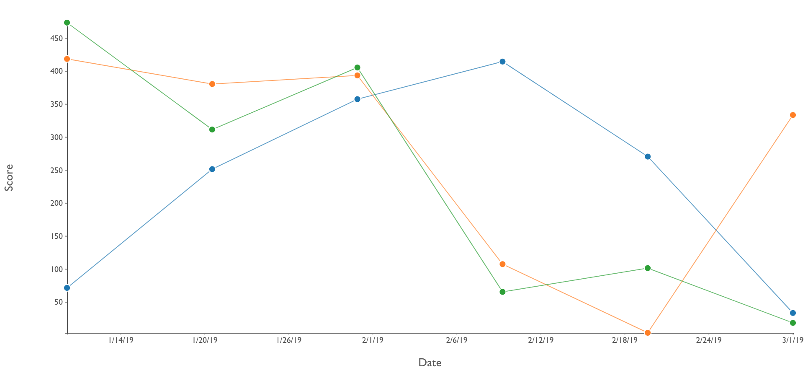
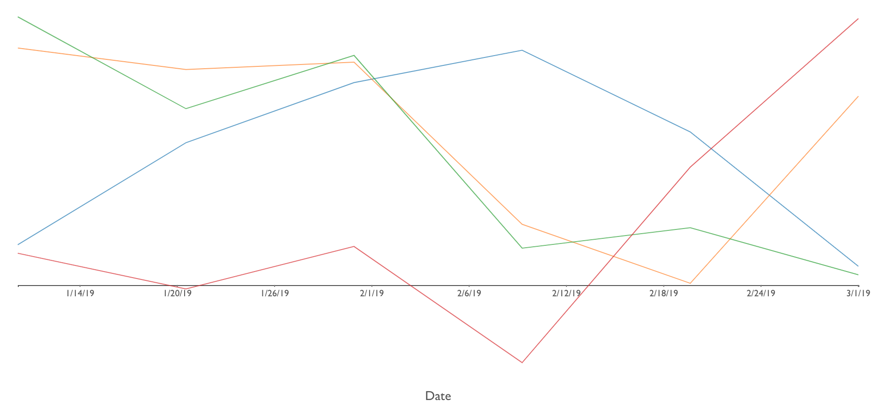
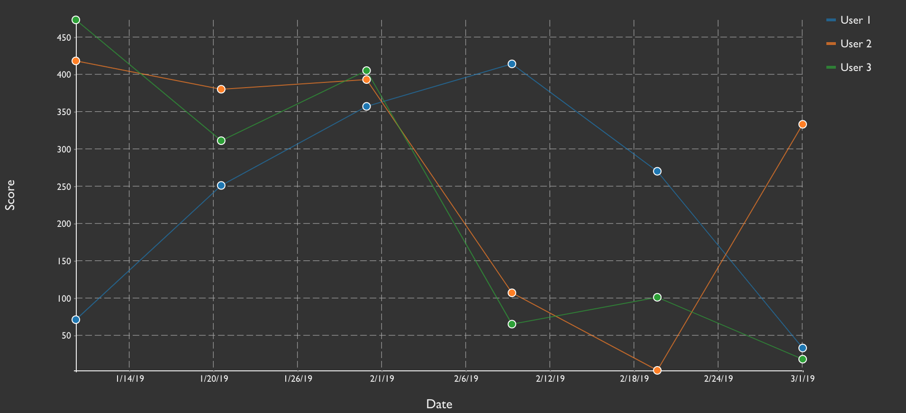
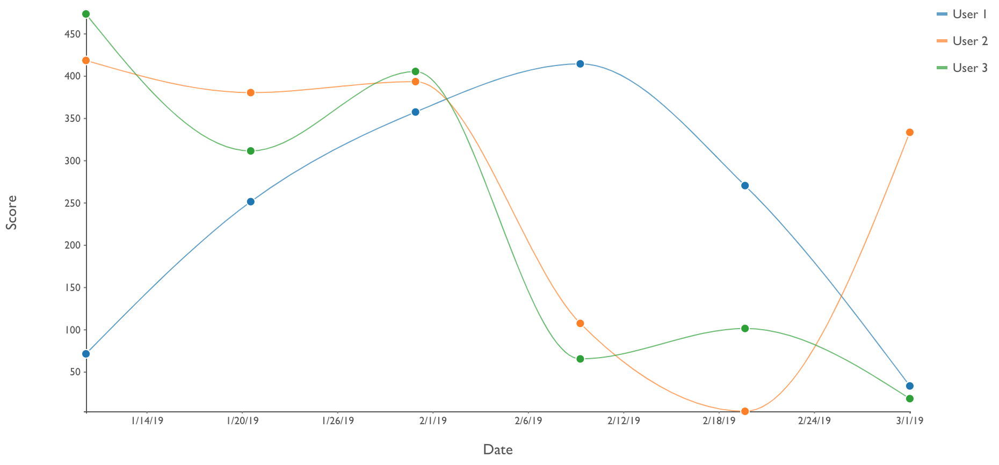

# ```<stv-line-chart>```

### Overview
A highly configurable, W3C-compliant web component for generating D3.js SVG line charts from pretty much any properly formatted data.  By using the modularized, ES6-ready distribution of D3.js (v5), the bundle size has been kept slim.

### Features
- Single or multi-line support
- Data rebind transitions
- Show or hide the X and/or Y axes
- Show or hide the X and/or Y axis tick values
- Show or hide the X and/or Y axis labels
- Show or hide a legend
- Show or hide path vertices
- Support for positive and negative values in the Y domain
- Configurable margins
- Configurable tick sizes
- Configurable axis font family
- `inverse` attribute for darker backgrounds
- Built in tooltips

### Examples









### Properties / Attributes

| Attribute &nbsp; &nbsp; &nbsp; &nbsp; &nbsp; &nbsp; &nbsp; &nbsp; &nbsp; &nbsp; &nbsp; &nbsp; &nbsp; &nbsp; &nbsp; &nbsp; &nbsp; &nbsp;  | Type | Default Value | Description |
| --------- | ---- | ------------- | ----------- |
| axis-label-font-size | number | 14 | Font size of optional X/Y axis labels |
| axis-tick-font-family | string | "sans" | "sans", "serif" or "monospace" |
| axis-tick-font-size | number | 10 | Font size of axis tick values |
| canvas-height | number | 300 | Height of SVG drawing canvas |
| canvas-width | number | 500 | Width of SVG drawing canvas |
| [chart-data](#chart-data) | array | [] | Array of objects used to populate the visualization |
| chart-id | string | "" | Optional id for custom element |
| color-scheme | string | "category10" | Color palette to use for lines.  See [Color Schemes](#color-schemes) below  |
| gridlines | bool | false | Display X/Y grid lines for value reference |
| hide-x-axis | bool | false | Hide both the X axis line and tick values |
| hide-x-ticks | bool | false | Hide only the X axis tick values |
| hide-y-axis | bool | false | Hide both the Y axis line and tick values |
| hide-y-ticks | bool | false | Hide only the Y axis tick values |
| [interpolation](https://github.com/d3/d3-shape) | string | "linear" | Options include "linear", "basis", "monotone", "step", "step-before" and "step-after"|
| inverse | bool | false | Invert axis and legend colors for use on a darker background |
| legend | bool | false | Set to true to show the right side legend |
| legend-font-size | number | 12 | Font size of legend text elements |
| legend-metric | string | "label" | Name of ```chartData.data``` property to display in the legend |
| legend-width | number | 125 | Width, in pixels, the legend will occupy in the drawing canvas. |
| margin-bottom | number | 25 | Bottom padding |
| margin-left | number | 25 | Left padding |
| margin-right | number | 25 | Right padding |
| margin-top | number | 25 | Top padding |
| responsive | bool | false | Set to true to listen to window.resize() events and re-render the chart with new calculated dimensions |
| stroke-width | number | 1 | Line width |
| tooltips | bool | true | Must be used with vertices = true.  Vertex hover event will display tooltip |
| vertices | bool | false | Show connector points between lines (svg:circle) |
| x-label | string | "" | X axis label or title |
| x-metric | string | "x" | The property in ```chartData.data``` denoting the X data domain |
| x-tick-format | string | "raw" | How to format the X axis tick values.  See the [tick formatting README](README-TICK-FORMAT.md). |
| x-tick-size | number | 2 | The length of the X axis tick lines |
| y-label | string | "" | Y axis label or title |
| y-metric | string | "y" | The property in ```chartData.data``` denoting the Y data domain |
| y-tick-format | string | "raw" | How to format the Y axis tick values.  See the [tick formatting README](README-TICK-FORMAT.md). |
| y-tick-size | number | 2 | The length of the Y axis tick lines |

### Events

| Type | Name | Description | CustomEvent.detail |
| ---- | ---- | ----------- | ------- |
| CustomEvent | stv-line-chart-loaded | Fired when component renders | `{component: 'stv-line-chart', chartId: String }` |

The rich ```chart-data``` property cannot, and should not, be set inline in the custom element with JSON.stringify().  Instead, listen for the `stv-line-chart-loaded` event and then use DOM selection tools to set the `chart-data` property, e.g. after an asynchronous API call.

### chart-data

Many visualization libraries enforce certain structure conventions on the data required to render a visualization and this enforcement is often overly-rigid.  In these cases, the transformations required of data coming directly from an API, for example, can be cumbersome at best.  `stencil-vizzle` components have been designed to offer some degree of flexibility in terms of mapping properties to chart values in the hopes of requiring little to no tranformation between data retrieval and assignment to the custom element.

#### Structure

```js
// src/interfaces/IfcStvLineChart.ts
interface StvLineChartItem {
  label?: string,
  color?: string,
  data: any[],
  [propName: string]: any
}

export interface IfcStvLineChart extends Array<StvLineChartItem>{}

// e.g.
myChartData = [
  IfcStvLineChartItem,
  IfcStvLineChartItem,
  ...etc.
]
```

`label`, `color`, and other user-defined properties are optional.  `data` is a required array.  If you desire user-defined colors for each line in the line chart, you will need to transform your data to add the `color` property accordingly.  Otherwise, use one of the built-in color palette identifiers.  See the [Color Schemes](#color-schemes) section of this README or [https://github.com/d3/d3-scale-chromatic](https://github.com/d3/d3-scale-chromatic).

The `data` property is a subjective array of objects. Each object in this array MUST have discernable X and Y properties with numeric values, but they do not necessarily have to be named "x" and "y".  If they are not named "x" and "y", set the `x-metric` and `y-metric` attributes accordingly.

#### Default Example
This JSON object will work "out of the box" because it has both the correct structure and all property names adhere to default conventions.

```js
var defaultData = [
  {
    label: 'User 1',
    color: '#0000ff',
    data: [
      {x: 1, y: 200},
      {x: 2, y: 75},
      {x: 3, y: 130}
    ]
  },
  {
    label: 'User 2',
    color: '#ff0000',
    data: [
      {x: 1, y: 30},
      {x: 2, y: 175},
      {x: 3, y: 88}
    ]
  }
]
```
With this ready-to-go `chartData` object, your HTML code might look something like:

```html
...
<stv-line-chart
  canvas-height="400"
  canvas-width="600"
  ...other attributes
></stv-line-chart>

<script>
  document.addEventListener('stv-line-chart-loaded', function() {
    document.querySelector('stv-line-chart').chartData = defaultData
    // When setting attributes with Javascript, use camelCase...chart-data = chartData
  })
</script>
...
```

#### Custom Example
```js
var customData = [
  {
    person: 'User 1',
    data: [
      {weekNumber: 1, score: 200},
      {weekNumber: 2, score: 75},
      {weekNumber: 3, score: 130}
    ]
  },
  {
    person : 'User 2',
    data: [
      {weekNumber: 1, score: 30},
      {weekNumber: 2, score: 175},
      {weekNumber: 3, score: 88}
    ]
  }
]
```

In the custom case, you'll need to use attributes to help your chart understand how to render the visualization, e.g.

- `color` property is missing, so one of the built-in palettes will be used, the default being `category10`
- `legend-metric` = "person"
- `x-metric` = "weekNumber"
- `y-metric` = "score"

...and your HTML might look something like this:

```html
<stv-line-chart
  canvas-height="400"
  canvas-width="600"
  legend-metric="person"
  x-metric="weekNumber"
  y-metric="score"
></stv-line-chart>

<script>
  document.addEventListener('stv-line-chart-loaded', function() {
    document.querySelector('stv-line-chart').chartData = customData
  })
</script>`
```

### Color Schemes

Each object in the `chartData.data` property may have a `color` property with hex value to force a certain color on a line, otherwise set the `color-scheme` attribute to one of the built-in values below which correspond to popular [color palettes](https://github.com/d3/d3-scale-chromatic) provided by the D3.js library.

- `category10`: schemeCategory10
- `accent`: schemeAccent
- `paired`: schemePaired
- `set1`: schemeSet1
- `set2`: schemeSet2
- `set3`: schemeSet3
- `black`: All lines/paths will be #000000
- `gray`: All lines/paths will be #888888

### Best Practices

- Set `chart-data` after render, not inline.
- Use boolean attributes as-is, e.g. `responsive` instead of `responsive="true"`
- When `responsive` is true, the `canvas-width` and `canvas-height` values are ignored and the dimensions of the parent container, most like a `<div>` are used to calculate the canvas dimensions.


