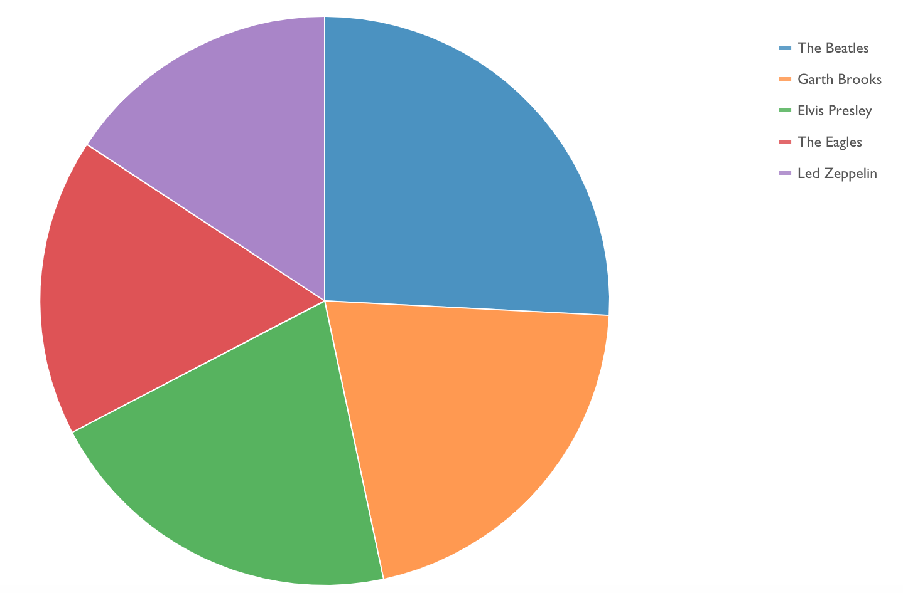
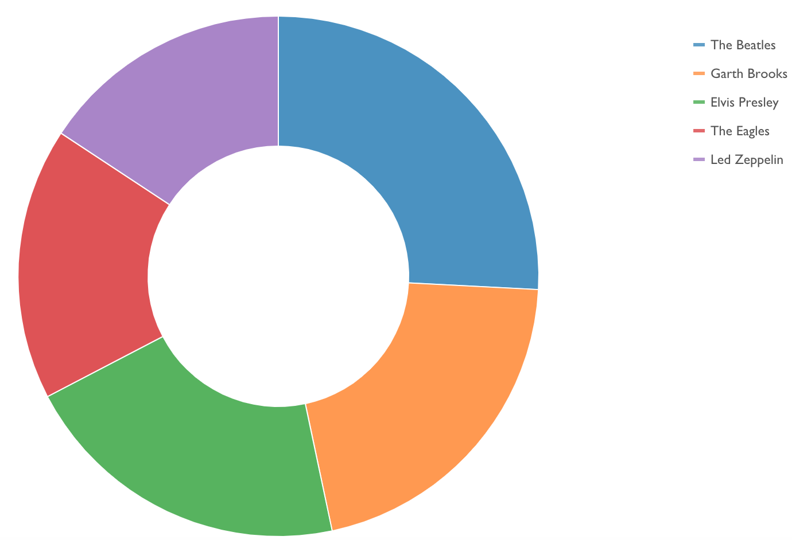
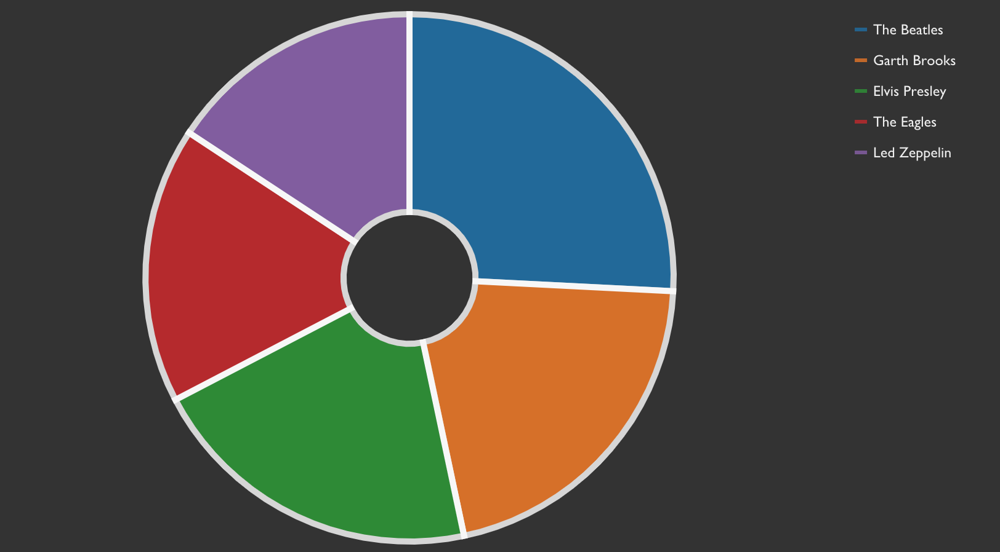

# ```<stv-pie-chart>```

### Overview
A highly configurable, W3C-compliant web component for generating D3.js SVG pie charts from pretty much any properly formatted data.  By using the modularized, ES6-ready distribution of D3.js (v5), the bundle size has been kept slim.

### Features
- Data rebind transitions
- Optional inner radius attribure to make a "donut" chart
- Configurable margins
- `inverse` attribute for darker backgrounds
- Built in tooltips

### Examples







### Properties / Attributes

| Attribute &nbsp; &nbsp; &nbsp; &nbsp; &nbsp; &nbsp; &nbsp; &nbsp; &nbsp; &nbsp; &nbsp; &nbsp; | Type | Default Value | Description |
| --------- | ---- | ------------- | ----------- |
| canvas-height | number | 300 | Height of SVG drawing canvas |
| canvas-width | number | 500 | Width of SVG drawing canvas |
| [chart-data](#chart-data) | array | [] | Array of objects used to populate the visualization |
| chart-id | string | "" | Optional id for custom element |
| color-scheme | string | "category10" | Color palette to use for arcs/wedges.  See [Color Schemes](#color-schemes) below  |
| inner-radius | number | 0 | Number >= 0 and less than 1.  Any value greater than 0 will make a "donut" chart |
| inverse | bool | false | Invert axis and legend colors for use on a darker background |
| legend | bool | false | Set to true to show the right side legend |
| legend-font-size | number | 12 | Font size of legend text elements |
| legend-metric | string | "label" | Name of ```chartData.data``` property to display in the legend |
| legend-width | number | 125 | Width, in pixels, the legend will occupy in the drawing canvas. |
| margin-bottom | number | 25 | Bottom padding |
| margin-left | number | 25 | Left padding |
| margin-right | number | 25 | Right padding |
| margin-top | number | 25 | Top padding |
| responsive | bool | false | Set to true to listen to window.resize() events and re-render the chart with new calculated dimensions |
| stroke | string | "transparent" | Stroke color for the arcs (wedges) |
| stroke-width | number | 1 | Stroke width for the arcs |
| tooltips | bool | true | Must be used with vertices = true.  Vertex hover event will display tooltip |
| value-format | string | "raw" | How to format the values in the tooltips. See the [tick formatting README](README-TICK-FORMAT.md) |
| value-metric | string | "value" | Property in `chartData` to map to the wedge size calculation function |

### Events

| Type | Name | Description | CustomEvent.detail |
| ---- | ---- | ----------- | ------- |
| CustomEvent | stv-pie-chart-loaded | Fired when component renders | `{component: 'stv-pie-chart', chartId: String }` |

The rich ```chart-data``` property cannot, and should not, be set inline in the custom element with JSON.stringify().  Instead, listen for the `stv-pie-chart-loaded` event and then use DOM selection tools to set the `chart-data` property, e.g. after an asynchronous API call.

### chart-data

Many visualization libraries enforce certain structure conventions on the data required to render a visualization and this enforcement is often overly-rigid.  In these cases, the transformations required of data coming directly from an API, for example, can be cumbersome at best.  `stencil-vizzle` components have been designed to offer some degree of flexibility in terms of mapping properties to chart values in the hopes of requiring little to no tranformation between data retrieval and assignment to the custom element.

#### Structure

```js
// src/interfaces/IfcStvPieChart.ts
interface StvPieChartItem {
  label?: string,
  value?: number,
  color?: string,
  [propName: string]: any
}

export interface IfcStvPieChart extends Array<StvPieChartItem>{}

// e.g.
myChartData = [
  StvPieChartItem,
  StvPieChartItem,
  ...etc.
]
```

Property names are subjective, but each object in the array MUST have a discernable numeric property to map to the `value-metric` attribute.  Additionally, to display the legend, each object must have a discernable numeric or string property to map to `legend-metric`.

If you desire user-defined colors for each wedge of the pie chart, you will need to transform your data to add the `color` property accordingly to each object.  Otherwise, use one of the built-in color palette identifiers.  See the [Color Schemes](#color-schemes) section of this README or [https://github.com/d3/d3-scale-chromatic](https://github.com/d3/d3-scale-chromatic).

#### Default Example
This JSON object will work "out of the box" because it has both the correct structure and all property names adhere to default conventions.

```js
var defaultData = [
  {
    label: 'User 1',
    value: 100,
    color: '#cc3300'
  },
  {
    label: 'User 2',
    value: 200,
    color: '#0000ff'
  },
  {
    label: 'User 3',
    value: 75,
    color: '#cc3399'
  }
]
```

With this ready-to-go `chartData` object, your HTML code might look something like:

```html
...
<stv-pie-chart
  canvas-height="400"
  canvas-width="600"
  ...other attributes
></stv-pie-chart>

<script>
  document.addEventListener('stv-pie-chart-loaded', function() {
    document.querySelector('stv-pie-chart').chartData = defaultData
    // When setting attributes with Javascript, use camelCase...chart-data = chartData
  })
</script>
...
```

#### Custom Example
```js
var customData = [
  {
    person: 'User 1',
    score: 100
  },
  {
    person: 'User 2',
    score: 200
  },
  {
    person: 'User 3',
    score: 75
  }
]
```

In the custom case, you'll need to use attributes to help your chart understand how to render the visualization, e.g.

- `color` property is missing, so one of the built-in palettes will be used, the default being `category10`
- `legend-metric` = "person"
- `value-metric` = "score"

...and your HTML might look something like this:

```html
<stv-pie-chart
  canvas-height="400"
  canvas-width="600"
  legend-metric="person"
  value-metric="score"
  color-scheme="set1"
></stv-pie-chart>

<script>
  document.addEventListener('stv-pie-chart-loaded', function() {
    document.querySelector('stv-pie-chart').chartData = customData
  })
</script>`
```

### Color Schemes

Each object in the `chartData.data` property may have a `color` property with hex value to force a certain color on an arc/wedge, otherwise set the `color-scheme` attribute to one of the built-in values below which correspond to popular [color palettes](https://github.com/d3/d3-scale-chromatic) provided by the D3.js library.

- `category10`: schemeCategory10
- `accent`: schemeAccent
- `paired`: schemePaired
- `set1`: schemeSet1
- `set2`: schemeSet2
- `set3`: schemeSet3
- `black`: All wedges will be #000000
- `gray`: All wedges will be #888888

### Best Practices

- Set `chart-data` after render, not inline.
- Use boolean attributes as-is, e.g. `responsive` instead of `responsive="true"`
- When `responsive` is true, the `canvas-width` and `canvas-height` values are ignored and the dimensions of the parent container, most like a `<div>` are used to calculate the canvas dimensions.
