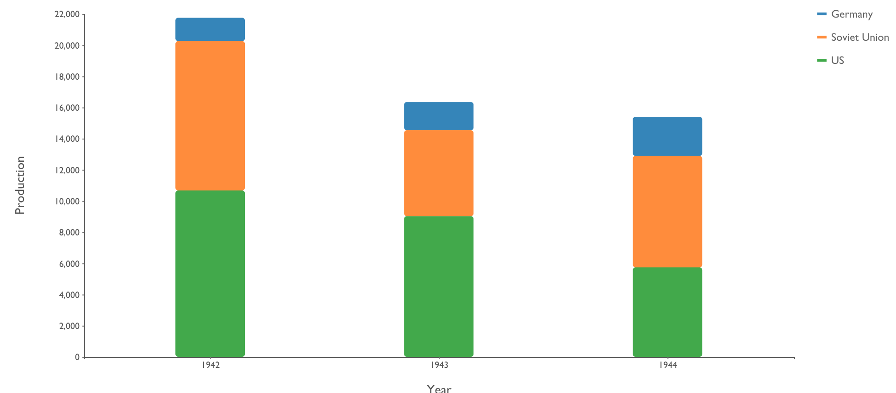
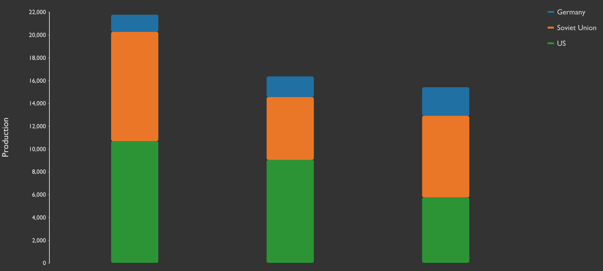
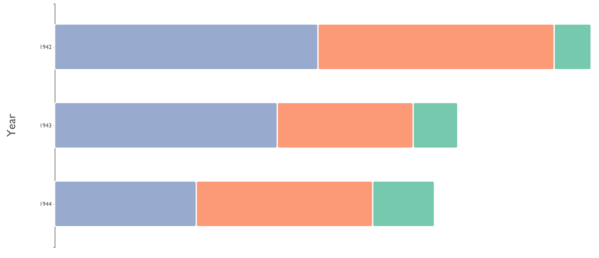

# ```<stv-stacked-bar-chart>```

### Overview
A highly configurable, W3C-compliant web component for generating D3.js SVG stacked bar charts from pretty much any properly formatted data.  By using the modularized, ES6-ready distribution of D3.js (v5), the bundle size has been kept slim.

### Features
- Data rebind transitions
- One axis is linearly scaled, the other is scaled ordinally.
- Show or hide the X and/or Y axes
- Show or hide the X and/or Y axis tick values
- Show or hide the X and/or Y axis labels
- Show or hide a legend
- Vertical (default) or horizontal orientation
- Configurable margins
- Configurable tick sizes
- Configurable axis font family
- `inverse` attribute for darker backgrounds
- Built in tooltips

### Examples





